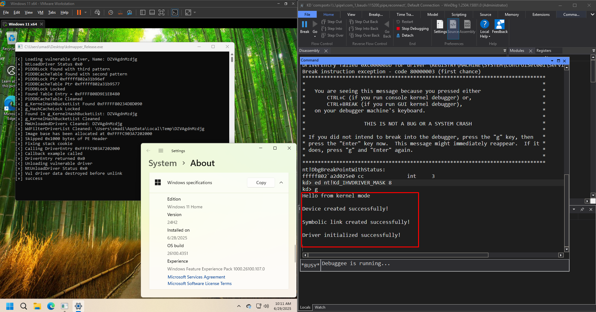
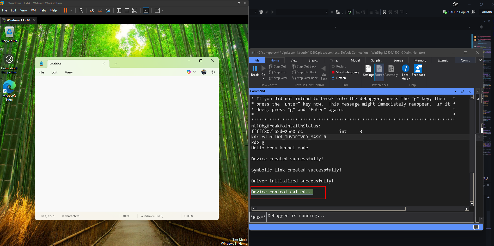

<div align="center">
  
  <p><em>KDMapper loading the SMADriver</em></p>
</div>

Overview
------

SMADriver is a Windows kernel mode driver with a user mode client to read/write memory of target processes.

- Open the `.sln` in Visual Studio (Debug x64) and build the solution.
- Grab the `umode`, `kmod`, and `kdmapper` binaries from `build/`.
- Drop them into your VM, disable Defender, and use `kdmapper` to load the driver.

**Host runs Visual Studio and WinDbg. VM runs the built binaries and is debugged over a named pipe.**  

**Tested on Windows 11 24H2 (host and VM).**

<div align="center">
  
  <p><em>Successful driver attachment to target process</em></p>
</div>

Driver
------

- Creates `\Device\SMDriver` and `\DosDevices\SMDriver`
- IOCTL codes:
  - `0x696`: Attach to process
  - `0x697`: Read memory
  - `0x698`: Write memory

User Mode
---------

- Finds target processes by name (e.g. `notepad.exe`)
- Talks to driver with `DeviceIoControl()`
- Helpers for reading/writing memory and getting module bases

Setup
-----

- Host: Visual Studio 2019/2022, WDK and Windows SDK
- VM: Windows 11 (VMware), Defender off, COM pipe added (e.g. `\\.\pipe\com_1`)
- Enable test signing and kernel debugging on host:

  ```
  bcdedit /set testsigning on
  bcdedit /set debug on
  bcdedit /dbgsettings serial debugport:1 baudrate:115200
  shutdown /r /t 0
  ```

- Open WinDbg on host, connect to pipe, start VM, then run:
  ```
  ed nt!Kd_IHVDRIVER_MASK 8
  g
  ```
